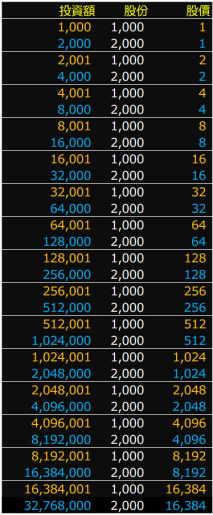

# 新創計創

找不到喜歡的角色嗎？沒問題，您可以自己為角色創立一間公司！

## 建立新角色 {#create-foundation}

在「新創計劃」頁面中，點擊「建立新角色」，填寫[公司的各項資訊](company.html#basic-info)後，支出**保證金 $1,024** 送出，即可為您心愛的角色發起一個**新創計劃**。

*在送出之前，請務必確認您所填寫的資訊是否符合[公司法](https://goo.gl/b2sscm)的規範，以免受罰！*

新創計劃建立後，將展開為期** 12 小時的募資**，發起人所投入的保證金也將計入募資清單中。在募資時間截止後，將依照募資狀況決定公司是否成功創立。

以下狀況將**禁止**玩家建立新創計劃：

* 市場上已經存在**相同名稱的公司**或**相同名稱的新創計創**
* 該玩家同時有**另一個進行中的新創計劃**
* 該玩家被**禁止擔任經理人**
* 該玩家正處於**渡假模式**
* 距離**商業季度結束 12 小時內**
* 賽季的**最後一個商業季度**

## 投資新創計劃 {#invest-foundation}

在新創計劃的募資期間內，玩家可以選擇對該新創計劃投入金錢以示支持。每次投入的金額為 **$50** 至 **$4,096** 之間，但同一人對該新創計劃的投資總額不得超過 **$4,096**。

## 新創成功 {#foundation-success}

若是新創計劃的投資期限截止時，有**超過 20 人**進行投資，則此新創計劃**成功**，公司將會創立。

新公司的**初始股價**以及**釋出股份**以下列過程進行計算：

1. 設初始股價為 $1。
2. 依照初始股價計算每個投資人能取得的股數，並加總為總釋股數。
3. 若總釋股數大於 2000 股，則將初始股價設為目前兩倍。
4. 重複以上兩步直到總釋股數低於 1000。
5. 將初始股價設為目前一半，此即為最後的初始股價。

為方便查詢，此過程整理為下表所示。

在完成初始股份的發放後，不足 1 股的投資金額將會退還給原投資人。舉例而言，若您投資了 $100，而該公司初始股價為 $64，則您將得到該公司股份 1 股，並取得 $36 的退款。

## 新創失敗 {#foundation-failure}

若是新創計劃的投資期限截止時，不符合[成功條件](#foundation-success)，則此新創計劃**失敗**。所有投資人的**投入金額將全數退還**，唯**發起人的保證金將被沒收**。
